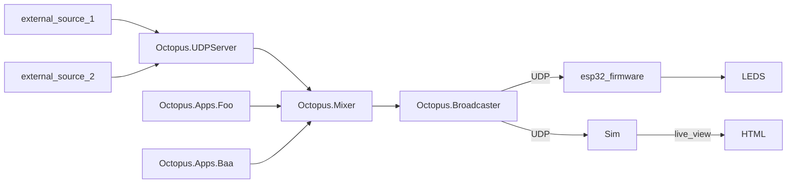

# letterbox
Blinkenlights Letterbox light installation in Mildenberg, Germany

# Architecture

```mermaid
graph LR
  external_source_1 --> udp_server
  external_source_2 --> udp_server
  
  udp_server[Octopus.UDPServer] --> mixer

  app_1[Octopus.Apps.Foo] --> mixer
  app_2[Octopus.Apps.Baa] --> mixer
  
  mixer[Octopus.Mixer]-->broadcast

  broadcast-->|UDP|esp32_firmware
  esp32_firmware-->LEDS

  broadcast[Octopus.Broadcaster] --> |UDP| sim
  sim[Sim]-->|live_view| live[HTML]
```
Missing: AppSupervisor, InputEvents, 

