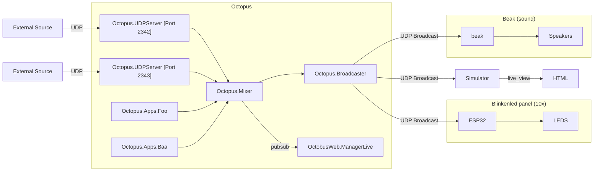
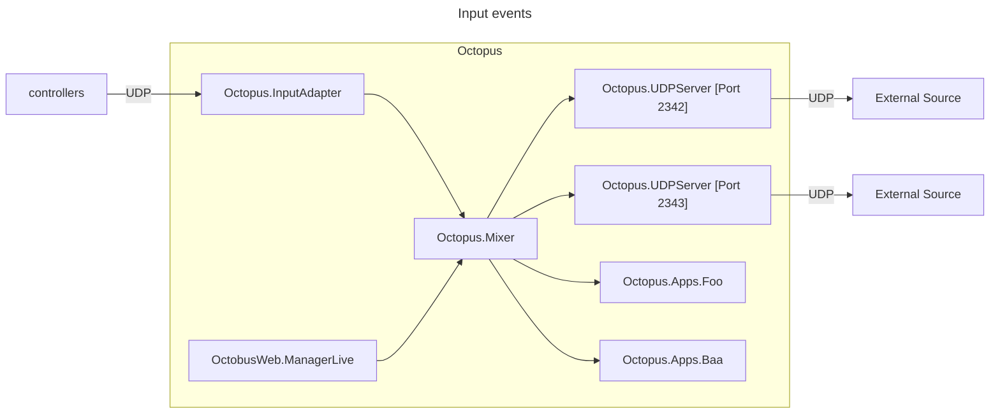

# Letterbox
Blinkenlights Letterbox light installation in Mildenberg, Germany.

## Components

| Name | Description | Documentation |
| ---- | ------------| ------------- |
| octopus | Central hub for the project.  Manages apps, mixes pixel streams, shows previews. | [Readme](./octopus/README.md)
| protobuf | Protobuf schema files for the data packets | [schema.proto](./protobuf/schema.proto)
| blinkenleds | ESP32 firmware that drives the LED panels | [Readme](./blinkenleds/README.md)
| calibration | Tooling to create color calibration tables for the Leds | [Readme](./calibration/README.md)
| beak | Audio engine that drives the sound output | todo

## Architecture

Protobuf is used everywhere as the wire format. All messages are wrapped in the `Packet` message to ensure save decoding. See the [schema](./protobuf/schema.proto) for more details.

### Data flow for pixel and sound outputs

### Data flow for input events

