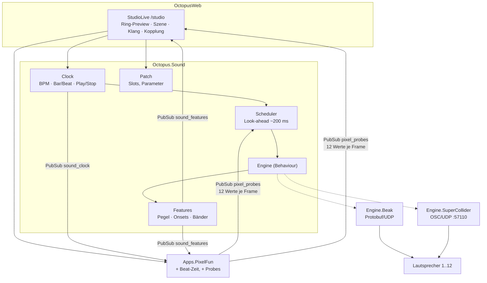

# 02 — Architektur

## Kernempfehlung in einem Satz

Eine **Engine-Behaviour** in Elixir, dahinter **beak als Tag-1-Backend** (läuft
heute, keine neue Abhängigkeit) und **SuperCollider als eigentliches Ziel** — die
Kompositions- und Sequencer-Schicht sowie die Oberfläche bleiben bei beidem gleich.

Damit ist die Frage „SuperCollider ja/nein" keine Weggabelung mehr, sondern ein
Zeitpunkt. Wir können sofort komponieren und die Engine später tauschen.

## Bestand

```mermaid
flowchart LR
  subgraph Octopus (Elixir)
    pf[Apps.PixelFun<br/>30 fps, Formel/Pixel] --> mixer[Mixer]
    mixer --> bc[Broadcaster]
    ia[InputAdapter<br/>UDP 2342] --> ev[Events.Router] --> pf
  end
  bc -->|UDP RGBFrame| esp[ESP32 Panels]
  bc -->|UDP AudioFrame/SynthFrame| beak[beak<br/>JUCE, 1 Kanal je Panel]
  beak --> spk[Lautsprecher 1..12]
  an[analyzer<br/>3-Band RMS] -->|UDP SoundToLightControlEvent| ia
```

Relevante Details:

- `Octopus.App.send_audio_event/1` und `send_synth_event/1` gehen über den Mixer an
  den Broadcaster und als Protobuf per UDP-Broadcast an beak.
- Kanalzahl = `Installation.num_panels()` (Nation2026: 12).
- `Octopus.Osc.Server` (Port 8000, `oscx`) empfängt bereits OSC für Params — d. h.
  **OSC ist im Stack schon etabliert**, in der einen Richtung.
- Pixelfun kennt bereits Audio-Input als Formelvariablen `l/m/h`.

## Optionsvergleich für die Klangengine

| Kriterium | **beak** (Bestand) | **SuperCollider** (`scsynth`) | Web Audio im Browser | Elixir-DSP (Membrane/NIF) |
|---|---|---|---|---|
| Läuft heute in der Installation | **ja** | nein (neue Abhängigkeit) | nein | nein |
| Multichannel 12-out | **ja**, ein Kanal je Panel | **ja**, nativ | nein (Client-Stereo) | ja, mit Aufwand |
| Klangvielfalt | Sampler + 1 Synth-Typ | **sehr hoch**, beliebige SynthDefs | mittel | niedrig ohne viel Arbeit |
| Sample-genaues Timing | nein (Ereignis bei Paketankunft) | **ja**, OSC-Bundle-Timetags | nein | theoretisch |
| Analyse-Rückweg | nur externer analyzer | **ja**, `SendReply` (Onsets, Bänder, Pegel) | ja, aber am falschen Ort | ja, mit Aufwand |
| Iterationsgeschwindigkeit beim Komponieren | C++-Build je Feature | **sehr hoch**, SynthDefs nachladbar | hoch | niedrig |
| Betriebsrisiko / Ops | **keins, bekannt** | Audio-Device, Dienst, Paket auf dem Pi | — | — |
| Elixir-Integration | Protobuf/UDP (vorhanden) | **OSC/UDP** (`oscx` vorhanden) | LiveView-Push | nativ |

**Ausgeschieden:** Web Audio (der Browser ist ein Bedienpanel, kein Teil der
Installation — im Betrieb ist gar keiner offen; außerdem darf die Zeitachse nicht im
Client liegen) und Elixir-DSP (der BEAM ist ein exzellenter Scheduler und ein
schlechter DSP-Kern).

**Empfehlung:** SuperCollider als Ziel. `scsynth` spricht OSC über UDP, kann Bundles
mit Timetags sample-genau in die Zukunft planen, hat 12 Ausgänge nativ und kann seine
eigene Analyse zurückschicken — genau die drei Dinge, die beak fehlen. Elixir
übernimmt die Rolle, die sonst `sclang` hat: Patterns, Zustand, Persistenz, UI.
Das ist eine ausgesprochen gute Aufgabenteilung — und `sclang` wird zur Laufzeit
**nicht** gebraucht.

## Zielarchitektur



### Prozessbaum

```
Octopus.Sound.Supervisor
├─ Sound.Clock          GenServer. Musikalischer Transport. Monotone Zeit,
│                       bpm/loop/position, Play/Stop, Tap. Broadcastet Beat-Phase
│                       auf PubSub "sound_clock" (für UI und Pixelfun).
├─ Sound.Scheduler      GenServer. Läuft alle ~50 ms, füllt ein Look-ahead-Fenster
│                       von ~200 ms mit Ereignissen (Step-Grid + Bindings) und
│                       übergibt sie mit absoluter Zielzeit an die Engine.
├─ Sound.Patch          Agent/GenServer. Aktueller Klang-Patch: Slots, Parameter,
│                       Mod-Matrix. Quelle der Wahrheit für die UI.
├─ Sound.Features       GenServer. Nimmt Analyse-Rückmeldungen entgegen,
│                       glättet sie, broadcastet auf "sound_features".
└─ Sound.Engine         Behaviour + gewähltes Backend:
   ├─ Engine.Beak                 Protobuf AudioFrame/SynthFrame (heute)
   └─ Engine.SuperCollider
      ├─ …​.OSC        UDP-Socket zu scsynth, Bundle-Encoding, /done, /status
      ├─ …​.Nodes      Node-ID-Allokation, Gruppen, Panic (/g_freeAll)
      └─ …​.Buffers    /b_allocRead, Sample-Registry
```

### Engine-Behaviour (Skizze, noch nicht implementiert)

```elixir
defmodule Octopus.Sound.Engine do
  @type at :: integer()          # absolute Zielzeit, :millisecond, System.system_time/1
  @type slot :: atom()
  @type params :: %{atom() => number()}

  @callback start_link(keyword()) :: GenServer.on_start()
  @callback note_on(slot(), at(), params()) :: {:ok, ref :: term()} | {:error, term()}
  @callback note_off(ref :: term(), at()) :: :ok
  @callback set(ref :: term() | slot(), at(), params()) :: :ok   # kontinuierliche Modulation
  @callback play_sample(slot(), at(), sample :: String.t(), params()) :: :ok
  @callback panic() :: :ok
  @callback capabilities() :: %{scheduling: :timestamped | :immediate, max_voices: pos_integer()}
end
```

`capabilities/0` ist der ehrliche Teil: unter Beak meldet die Engine
`scheduling: :immediate`, der Scheduler schickt dann *just in time* statt vorausgeplant
und die UI zeigt „Timing: best effort". Unter SC meldet sie `:timestamped`.

## Der kritische Punkt: Zeit

Drei Uhren treffen aufeinander, das ist die eigentliche Ingenieursarbeit:

1. **BEAM-Timer.** `Process.send_after` hat Millisekunden-Jitter, unter Last mehr.
   Für Grafik völlig ausreichend, für Perkussion nicht.
2. **Frame-Raster.** Pixelfun rendert mit 30 fps → Bild ist inhärent auf ~33 ms
   gequantelt. Das lässt sich nicht wegdiskutieren, nur einmessen.
3. **Audio-Puffer.** SC/beak haben Blockgrößen und Gerätelatenz.

Lösung, Standardpraxis aus Sequencer-Bau:

- **Alles mit Vorlauf planen.** Der Scheduler arbeitet mit einer festen Latenz
  `L ≈ 150–250 ms`: Ereignisse für `now + L` werden jetzt berechnet und mit
  absoluter Zielzeit übergeben. `scsynth` führt sie sample-genau aus. BEAM-Jitter
  verschwindet vollständig, solange `L` größer als der Jitter ist.
- **Ein AV-Offset** (± ms, persistent) verschiebt die Bildzeit gegen die Tonzeit und
  fängt Frame-Raster, LED-Kette und Audiopuffer als eine Konstante ab.
- **Interaktive Eingaben** (Regler bewegen, Note von Hand triggern) gehen bewusst
  ohne Vorlauf raus — dafür fühlbar direkt statt taktgenau.
- **Uhrenabgleich.** Timetags sind NTP-Zeit der Maschine, auf der `scsynth` läuft.
  Solange scsynth auf demselben Host läuft, reicht `System.system_time/1`. Bei
  getrennten Hosts: chrony/NTP oder ein gemessener Offset (`/status`-Roundtrip).

> Zu prüfen: ob `oscx` 0.1.1 Bundle-Timetags korrekt kodiert. Falls nicht, ist das
> kein Blocker — ein OSC-Bundle ist `"#bundle\0"` + 8 Byte Timetag + je Element
> 4-Byte-Länge + Message. Das schreibt man in 30 Zeilen selbst.

## Der zweite kritische Punkt: Auswertungsrate der Formel

Die Formel läuft **nicht** auf Audiorate. Das ist eine harte Grenze und zugleich
keine echte Einschränkung:

- Pixelfun wertet heute pro Frame ~768 Pixel (Nation2026) im AST-Interpreter aus.
  Das auf 48 kHz zu heben ist um Größenordnungen unmöglich.
- Stattdessen: **Control-Rate**. Die Formel liefert pro Frame (30 Hz) oder pro Step
  einige wenige Werte — die **Probes** — und die gehen als OSC-Parameter an die
  Synths. Die Audiorate macht SC.
- Kosten: 12 zusätzliche Auswertungen pro Frame gegenüber 768. Vernachlässigbar.

Damit ist die „tixy für Audio"-Idee auf ihre tragfähige Form gebracht: die Formel ist
der **Modulator und Dirigent**, nicht der Oszillator.

## Anbindung an Pixelfun — bewusst minimalinvasiv

`pixel_fun.ex` hat ~3100 Zeilen. Da kommt kein Sequencer rein. Nötig sind nur zwei
kleine Erweiterungen:

1. **Beat-Zeit (optional pro Szene).** Ein Feld `time_source: :seconds | :beats`.
   Bei `:beats` kommt `t` aus `Sound.Clock` statt aus der Wanduhr; die Auto-Sweeps
   bekommen zusätzlich Intervalle in Takten statt Sekunden.
2. **Probes.** Wenn aktiviert, wertet der Renderer die Formel zusätzlich an N
   definierten Punkten aus (Default: die 12 Panelmitten) und broadcastet
   `{:pixel_probes, %{t_beats: _, values: [...]}}`. Nichts anderes ändert sich.

Der Feature-Rückweg braucht **gar keine Änderung**: `Sound.Features` kann seine Werte
über den vorhandenen `AudioEvent`-Pfad einspeisen, dann funktionieren `l/m/h` in jeder
Formel sofort. Zusätzliche Variablen (`beat`, `bar`, `onset`, …) wären ein zweiter,
späterer Schritt in `Program`/`env`.

## Datenmodell

Passt sich in das vorhandene Preset-System ein (SQLite/Ecto, `app_mode_presets`):

```
Composition
├─ name, notes
├─ scene            → Pixelfun-Preset-Id oder eingebettete Szenenconfig
├─ patch            → Slots: [%{id, kind: :synth|:sample, def, params, channel_map}]
├─ pattern          → Steps: [%{slot, step, panel, velocity, prob, ratchet}]
├─ bindings         → Mod-Matrix: [%{source, target, amount, curve}]
└─ transport        → bpm, loop_bars, swing, av_offset_ms, master_gain
```

Weil eine Komposition ein Preset ist, kann `InstallationTransport` sie **ohne
Sonderweg in die Rotation** aufnehmen — das ist der Grund, es genau so zu schneiden.

## Deployment

- **scsynth als Host-Dienst**, nicht im Container. Audio in Docker (`/dev/snd`,
  Realtime-Priorität, JACK-Sockets) ist unnötiger Schmerz. Octopus im Container
  spricht UDP nach `127.0.0.1:57110`. Auf Debian/RPi: `apt install supercollider-server`
  (bzw. `supercollider`), Start per systemd-Unit mit `-u 57110 -o 12 -a 1024`.
- **SynthDefs** werden **nicht** zur Laufzeit kompiliert. Quellen als `.sc` in
  `octopus/priv/synthdefs/src/`, kompilierte `.scsyndef` daneben eingecheckt, geladen
  per `/d_loadDir` beim Start. `sclang` wird dann nur zum Bauen gebraucht (make-Target),
  nicht im Betrieb.
- **Samples** in `octopus/priv/audio/` (kleine Dateien) bzw. auf einem Datenvolume,
  registriert in der DB; `/b_allocRead` beim Patch-Laden.
- **Koexistenz mit beak:** eine Soundkarte, zwei Prozesse — geht nur mit JACK oder
  ALSA-dmix, und beides ist im Livebetrieb Ärger. Sauberste Variante: **während der
  AV-App gehört die Karte SC**, beak läuft dann nicht (bzw. andersherum). Die
  Engine-Behaviour macht das zu einer Konfigurationsfrage, nicht zu einem Umbau.
- **Hardware-Voraussetzung:** ein Interface mit ≥12 Ausgängen. Das existiert für
  beak bereits — welches Gerät und wie die Kanäle physisch auf die Panels gemappt
  sind, muss verifiziert werden (siehe offene Fragen).

## Risiken

| Risiko | Wirkung | Gegenmaßnahme |
|---|---|---|
| SC-Betrieb auf dem Zielrechner (Gerät, xruns, Autostart) | AV-Modus fällt aus | Engine-Behaviour: Beak-Backend als Rückfallebene, Health-Check + Reconnect, `/status`-Watchdog |
| Audio-Device-Konflikt beak ↔ SC | kein Ton oder Crash | genau eine Engine aktiv; explizite Konfiguration, in der UI sichtbar |
| `oscx` kann keine Timetags | kein sample-genaues Timing | eigener Bundle-Encoder (klein), Testabdeckung |
| Jitter/Last auf dem Pi (12×64 px Render + Sequencer) | Frame-Drops | Probes statt Vollauswertung, Scheduler entkoppelt vom Renderer, Lastmessung im Transport sichtbar |
| Formel-Komplexität × Audio-Kopplung wird unbedienbar | niemand komponiert damit | UI-Prinzip „Kopplung ist sichtbar": Mod-Matrix zeigt live fließende Werte |
| Lautstärke/Nachbarschaft im Betrieb | Abschaltung vor Ort | Master-Limiter, Zeitprofile, Pegelobergrenze je Komposition |

## Empfohlene Ausbaustufen

- **Stufe 0 — Kopplungsmodell beweisen (ohne neue Abhängigkeit).**
  `Sound.Clock` + `Sound.Scheduler` + `Engine.Beak`, Probes in Pixelfun, Ring-Chase
  und Sample-Kammern. Bereits spielbar, bereits in der Rotation lauffähig.
- **Stufe 1 — Studio-Oberfläche.** `/studio` mit Transport, Ring-Preview,
  Szeneneditor (bestehende Komponente eingebettet), Slots, Step-Grid, Mod-Matrix,
  Speichern als Komposition.
- **Stufe 2 — SuperCollider.** `Engine.SuperCollider`, SynthDef-Set, Buffers,
  Timetag-Scheduling, Feature-Rückkanal per `SendReply`. Die UI ändert sich nicht.
- **Stufe 3 — Umgebung als Instrument.** Radar/Crowd als Modulationsquelle,
  externes Line-In, Performance-Modus, Tageszeit-Profile.
